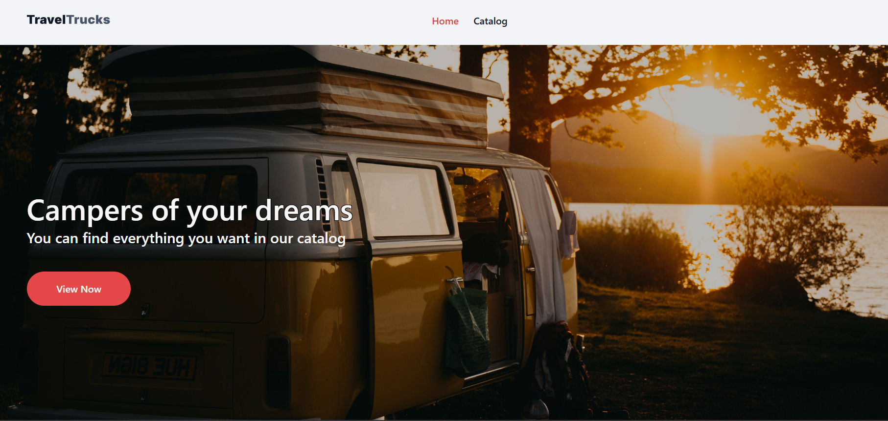
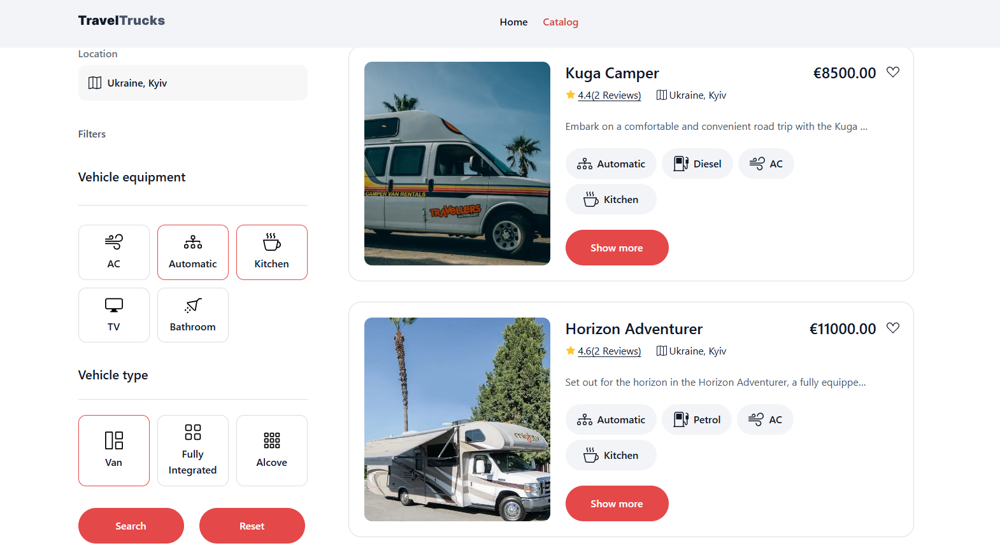

# 🚐 **Camper Rental App**
### *Responsive campervan rental platform built with Next.js & TypeScript*

---

### 🔗 **Live Demo**
👉 [https://camper-rental-app.vercel.app/](https://camper-rental-app-rose.vercel.app/)

### 🎨 **Figma Design**
👉 https://www.figma.com/design/6vTbzaB3EPgOreQz2jOJJe/Campers?node-id=0-1&t=wWUj9PeSd7v1KZ5q-1

---

## 🖼️ Preview

---

## 📌 Overview

**Camper Rental App** is a modern frontend application for browsing and booking campervans.  
The project focuses on **clean UI**, **realistic UX flows**, and **production-style frontend architecture**.

This is a **frontend-only application** designed to demonstrate real-world frontend skills, including:

- Component-driven UI development
- Client-side state management
- Data fetching with caching
- Form validation and UX edge cases
- Pixel-accurate layout based on a real Figma design

---

## ✨ Key Features

| Feature | Description |
|------|------------|
| 🚐 Camper catalog | Browse available campers with key details |
| 🔍 Filters | Filter campers by equipment and vehicle type |
| ❤️ Favorites | Add/remove campers to favorites (persisted state) |
| 📄 Camper details | Separate detail page with full description |
| 📅 Booking form | Date picker, validation, error handling |
| 💾 Draft persistence | Unsent form data saved via Zustand |
| 🎨 Design fidelity | UI closely follows the Figma layout |

---

## 🧠 What’s Implemented (Practically)

- **Next.js App Router** with a clear separation of server and client components
- **TanStack Query** for API data fetching and caching
- **Zustand** for:
  - favorites state
  - form draft persistence
- **Form validation** with real UX constraints
- **Custom DatePicker integration**
- **CSS Modules** for scoped, maintainable styles
- **Accessible UI elements** (buttons, inputs, aria attributes)
- **Clean project structure** suitable for scaling

---

 🧡 <i>Built as a production-style frontend project to demonstrate real-world React / Next.js patterns.</i> 

